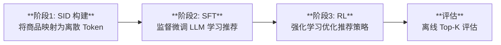
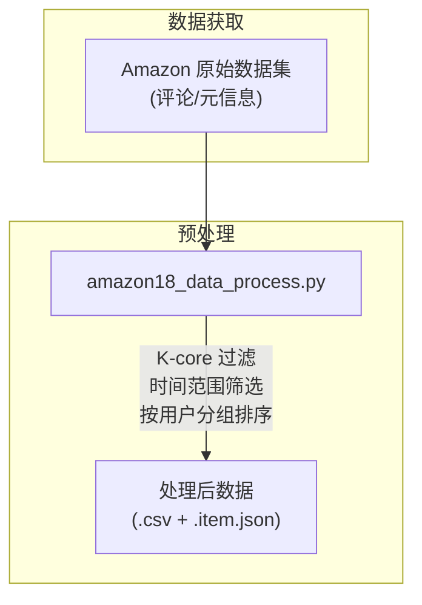
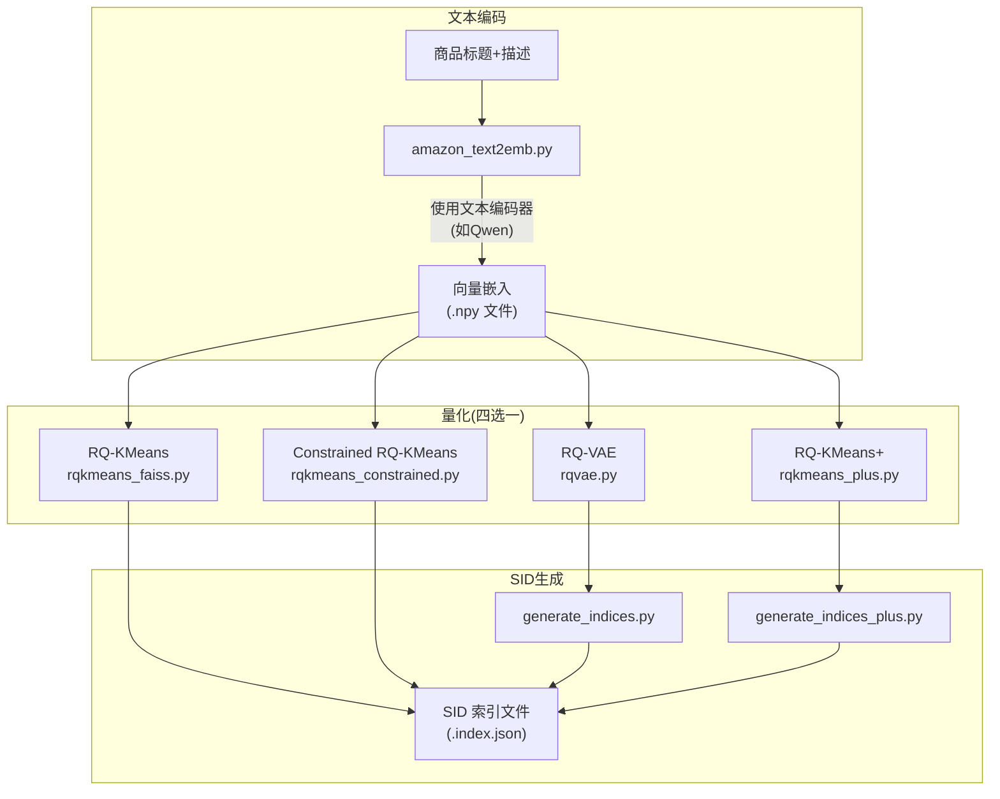
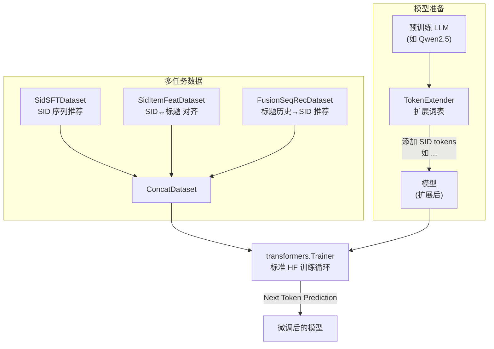
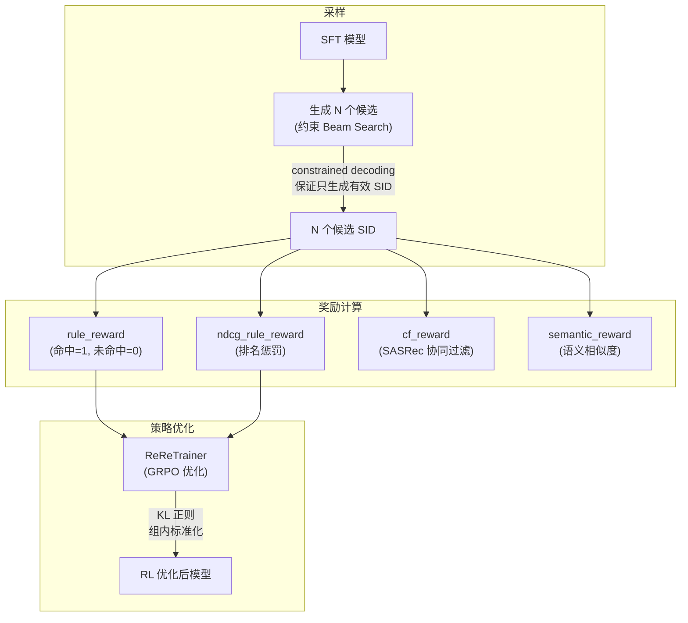
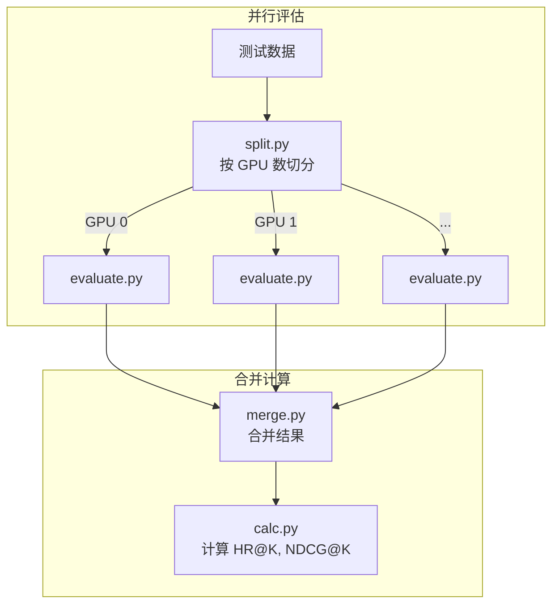
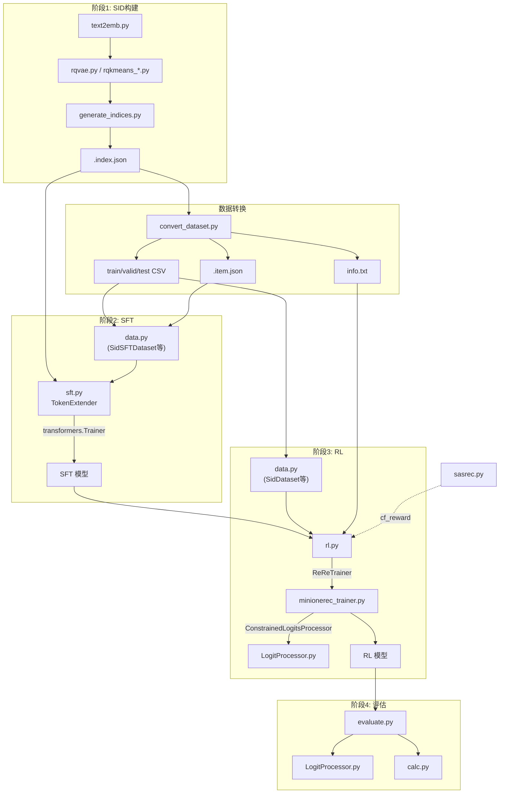

# MiniOneRec 项目深度理解报告

## 一、项目总览

**MiniOneRec** 是第一个完全开源的**生成式推荐**（Generative Recommendation）框架。它的核心思路是：**将推荐问题转化为大语言模型（LLM）的序列生成问题**。

整个系统的流水线分为三个核心阶段：

---

## 二、核心理念：把推荐变成「造句」

传统推荐系统为每个用户计算物品的评分，然后排序。MiniOneRec 的做法完全不同：

1. **给每个商品一个「名字」**（Semantic ID, SID）：比如 `<a_42><b_17><c_203>`，这就像给商品取了一个由三个特殊 token 组成的独特标识符
2. **让 LLM 学会用这些 SID 来「说话」**：将用户的历史交互序列作为 prompt，让 LLM 生成（预测）下一个商品的 SID
3. **用强化学习让 LLM「说得更准」**：通过 GRPO 算法奖励正确的推荐、惩罚错误的推荐

---

## 三、阶段详解 + 代码对应关系

### 阶段 0：数据准备

#### 流程

| 文件 | 作用 |
|------|------|
| [amazon18_data_process.py](file:///e:/MiniOneRec/data/amazon18_data_process.py) | 处理 Amazon 2018 数据集。执行 K-core 过滤（默认 user_k=5, item_k=5），按时间范围筛选交互记录，为每个用户按时间排序交互历史，输出为 train/valid/test 的 CSV 文件和 item 元信息 |
| [amazon18_data_process.sh](file:///e:/MiniOneRec/data/amazon18_data_process.sh) | 调用上述 Python 脚本的 Shell 入口 |
| [amazon23_data_process.py](file:///e:/MiniOneRec/data/amazon23_data_process.py) | 处理 Amazon 2023 数据集，逻辑类似 |
| [amazon18_data_process_gpr.py](file:///e:/MiniOneRec/data/amazon18_data_process_gpr.py) | GPR 风格的数据预处理变体，额外提取异构特征（User/Entity/Item/Other tokens）|

---

### 阶段 1：SID 构建（Semantic ID Construction）

#### 核心思想
将每个商品的文本信息（标题 + 描述）编码为一个**紧凑的离散 token 序列**。

#### 流程

#### 文件详解

| 文件 | 作用 |
|------|------|
| [amazon_text2emb.py](file:///e:/MiniOneRec/rq/text2emb/amazon_text2emb.py) | 用文本编码模型（如 Qwen）将每个商品的 `title + description` 编码为高维向量（如 2560 维），存储为 `.npy` 文件。支持基于 Accelerate 的多 GPU 并行 |
| [rqvae.py](file:///e:/MiniOneRec/rq/rqvae.py) | **RQ-VAE 训练**：用残差量化变分自编码器将连续向量量化为三级离散码（如 `[42, 17, 203]`），每级有 256 个码字。模型结构为 `Encoder MLP → 三层 VQ 量化 → Decoder MLP` |
| [rqkmeans_faiss.py](file:///e:/MiniOneRec/rq/rqkmeans_faiss.py) | **RQ-KMeans 训练**：基于 FAISS 的残差量化 K-Means。先对全量数据聚类，再对残差聚类，逐层细化。附带 Sinkhorn 均衡映射，确保码字分布均匀 |
| [rqkmeans_constrained.py](file:///e:/MiniOneRec/rq/rqkmeans_constrained.py) | **Constrained RQ-KMeans**：使用 `k_means_constrained` 库实现平衡约束聚类，保证每个簇大小均匀。对冲突的商品追加额外层去重 |
| [rqkmeans_plus.py](file:///e:/MiniOneRec/rq/rqkmeans_plus.py) | **RQ-KMeans+**：首次开源复现 GPR 论文提出的方法。核心创新：①将 Encoder 包装为残差连接（`Z = X + MLP(X)`），②用 Constrained RQ-KMeans 的码本热启动 RQ-VAE 的码本权重，③ Encoder 最后一层零初始化 |
| [generate_indices.py](file:///e:/MiniOneRec/rq/generate_indices.py) | 加载训练好的 RQ-VAE 模型，为每个商品生成 SID。使用 Sinkhorn 处理碰撞（多个商品映射到同一个 SID 时重新量化），输出 `.index.json` |
| [generate_indices_plus.py](file:///e:/MiniOneRec/rq/generate_indices_plus.py) | RQ-KMeans+ 的 SID 生成器，使用 Polars 的 `deal_with_deduplicate` 函数处理碰撞（追加行索引来去重），输出 `.index.json` |
| [trainer.py](file:///e:/MiniOneRec/rq/trainer.py) | RQ-VAE/RQ-KMeans+ 模型的通用训练器 |
| [datasets.py](file:///e:/MiniOneRec/rq/datasets.py) | `EmbDataset` 类：加载 `.npy` 向量作为 PyTorch Dataset |

**SID 的格式**：每个商品得到形如 `["<a_42>", "<b_17>", "<c_203>"]` 的三层 token 序列，其中 `a/b/c` 表示层级，数字表示该层的码字索引。

---

### 阶段 1.5：数据格式转换

| 文件 | 作用 |
|------|------|
| [convert_dataset.py](file:///e:/MiniOneRec/convert_dataset.py) | 将预处理后的数据 + SID 索引转换为 SFT/RL 训练所需的格式。具体做法：①加载 `.index.json` 和 `.item.json`，②将每个交互记录中的 item_id 替换为对应的 SID，③生成 train/valid/test 的 CSV 文件（内含用户 SID 历史和目标 SID），④生成 `.info.txt`（SID→标题→item_id 映射） |
| [convert_dataset_gpr.py](file:///e:/MiniOneRec/convert_dataset_gpr.py) | GPR 风格的数据转换：注入模拟的异构 token（U/E/I/O）来模拟统一输入表示 |

---

### 阶段 2：监督微调（SFT）

#### 核心思想
让 LLM 通过**下一个 token 预测**学会「根据用户历史 SID 来生成下一个商品的 SID」，同时训练**语言对齐任务**（SID↔自然语言 双向翻译），帮助推荐器继承 LLM 的世界知识。

#### 流程

#### 文件详解

| 文件 | 作用 |
|------|------|
| [sft.py](file:///e:/MiniOneRec/sft.py) | **SFT 训练主入口**。核心逻辑：①`TokenExtender` 从 `.index.json` 提取所有 SID token 加入 tokenizer 词表，②调整模型 embedding 层大小，③构建三个训练数据集的 `ConcatDataset`，④使用 HuggingFace `Trainer` 进行标准训练，支持 DDP 多卡、冻结 LLM 仅训练 SID embedding |
| [sft.sh](file:///e:/MiniOneRec/sft.sh) | SFT 启动脚本：使用 `torchrun` 8 卡并行 |
| [sft_gpr.py](file:///e:/MiniOneRec/sft_gpr.py) | GPR 风格 SFT：实现 **Value-Aware Fine-Tuning (VAFT)**，根据模拟的 item 价值对 loss 加权 |

#### SFT 阶段使用的数据集（定义在 [data.py](file:///e:/MiniOneRec/data.py) 中）

| 数据集类 | 任务描述 | Prompt 格式 |
|----------|----------|-------------|
| `SidSFTDataset` | **核心任务**：基于 SID 历史序列推荐下一个 SID | `"Here is the interaction history of a user... The user will like: "` → 目标 SID |
| `SidItemFeatDataset` | **对齐任务**：SID↔标题 双向翻译 | `"What is the title of <a_42><b_17><c_203>?"` → 标题 / `"What is the SID of xxx?"` → SID |
| `FusionSeqRecDataset` | **融合任务**：用商品标题/描述序列推荐下一个 SID | 用自然语言的交互历史来预测 SID |

---

### 阶段 3：推荐导向强化学习（Recommendation-Oriented RL）

#### 核心思想
使用 **GRPO（Group Relative Policy Optimization）** 算法，对 SFT 模型进一步优化。为每个 prompt 生成多个候选推荐，通过奖励信号指导模型生成更好的推荐。

#### 流程

#### 文件详解

| 文件 | 作用 |
|------|------|
| [rl.py](file:///e:/MiniOneRec/rl.py) | **RL 训练主入口**。核心逻辑：①构建三个 RL 数据集的 `ConcatDataset`（`SidDataset` + `RLTitle2SidDataset` + `RLSeqTitle2SidDataset`），②定义四种奖励函数，③实例化 `ReReTrainer` 并训练 |
| [rl.sh](file:///e:/MiniOneRec/rl.sh) | RL 启动脚本：使用 `accelerate launch` + DeepSpeed ZeRO-2 配置 |
| [rl_gpr.py](file:///e:/MiniOneRec/rl_gpr.py) | GPR 风格 RL：实现 **Hierarchy Enhanced Policy Optimization (HEPO)** |
| [minionerec_trainer.py](file:///e:/MiniOneRec/minionerec_trainer.py) | **`ReReTrainer` 类（核心）**：继承自 TRL 的 `GRPOTrainer`，专门为推荐场景定制。核心功能：①**约束 Beam Search 采样**：通过 `prefix_allowed_tokens_fn` + Trie 树保证每个 beam 只生成合法的 SID 序列，②**生成去重**：保证每个 beam 的 SID 不重复，③**组内奖励标准化**：GRPO 核心——同一 prompt 的 N 个候选的奖励在组内标准化来计算优势函数，④**KL 散度正则化**：保持更新后策略与参考策略接近，⑤支持 DAPO/GSPO 变体 |
| [LogitProcessor.py](file:///e:/MiniOneRec/LogitProcessor.py) | **`ConstrainedLogitsProcessor` 类**：在生成时实时约束 logits。对每个 beam 的每一步，通过 `prefix_allowed_tokens_fn` 查询合法的下一个 token，将非法 token 的 logits 设为 `-inf`，保证只能生成合法的 SID token 组合 |

#### 四种奖励函数

| 奖励函数 | 定义 | 信号 |
|----------|------|------|
| `rule_reward` | 生成的 SID 完全匹配目标 → 1.0，否则 → 0.0 | 二值精确匹配 |
| `ndcg_rule_reward` | 在 group 内命中目标得 0，未命中得 `-1/log2(rank+2)` 的负归一化值；若整组都未命中则全 0 | 排名感知惩罚 |
| `semantic_reward` | 计算候选商品与目标商品 embedding 的余弦相似度 | 语义相似度 |
| `cf_reward` | 使用预训练的 SASRec 模型对候选商品评分 | 协同过滤信号 |

默认使用 `ranking` 类型（`rule_reward` + `ndcg_rule_reward` 组合）。

#### RL 阶段使用的数据集

| 数据集类 | 任务 |
|----------|------|
| `SidDataset` | SID 历史 → SID 推荐 |
| `RLTitle2SidDataset` | 商品标题/描述 → SID |
| `RLSeqTitle2SidDataset` | 标题序列 → SID 推荐 |

---

### 阶段 4：离线评估

#### 流程

#### 文件详解

| 文件 | 作用 |
|------|------|
| [evaluate.sh](file:///e:/MiniOneRec/evaluate.sh) | **评估入口脚本**：将测试数据切分到 8 个 GPU 上并行评估，合并结果后计算指标 |
| [split.py](file:///e:/MiniOneRec/split.py) | 将测试 CSV 按 GPU 数量等分 |
| [evaluate.py](file:///e:/MiniOneRec/evaluate.py) | **评估核心**：加载模型，对每个测试样本使用约束 Beam Search 生成 Top-K 推荐，保存预测结果为 JSON |
| [merge.py](file:///e:/MiniOneRec/merge.py) | 合并多个 GPU 的评估结果 JSON |
| [calc.py](file:///e:/MiniOneRec/calc.py) | 计算 **HR@K**（Hit Rate）和 **NDCG@K** 指标；同时统计 **CC**（Constrained decoding failure Count），CC 非零说明约束解码失败，生成了无效 SID |

---

### 辅助模块

| 文件 | 作用 |
|------|------|
| [sasrec.py](file:///e:/MiniOneRec/sasrec.py) | **SASRec 协同过滤模型**：一个完整的 Self-Attention Sequential Recommendation 模型（含 GRU、Caser 变体），用于 RL 阶段的 `cf_reward` 奖励计算。可独立训练 |
| [SASRecModules_ori.py](file:///e:/MiniOneRec/SASRecModules_ori.py) | SASRec 的底层模块（多头注意力、位置编码等 PyTorch 实现） |
| [utility.py](file:///e:/MiniOneRec/utility.py) | 工具函数集合：`pad_history`（序列补齐）、`extract_axis_1`（张量索引）、`calculate_hit`（命中率计算）、`NeuProcessEncoder`（神经过程编码器）、`MemoryUnit`（注意力记忆单元）|
| [config/zero2_opt.yaml](file:///e:/MiniOneRec/config/zero2_opt.yaml) | DeepSpeed ZeRO Stage-2 优化器配置，供 RL 阶段 `accelerate launch` 使用 |
| [data_test.py](file:///e:/MiniOneRec/data_test.py) | 数据集的测试/调试脚本 |

---

## 四、代码调用关系总览

---

## 五、关键设计亮点

### 1. 约束解码（Constrained Decoding）
这是整个系统最关键的技术点之一。由于 LLM 的输出空间是整个词表，但合法的推荐只有有限的 SID 组合。因此:
- 在训练/推理时，构建一棵**前缀 Trie 树**，存储所有合法的 SID 序列
- `ConstrainedLogitsProcessor` 在每一步生成时，只允许 Trie 树中合法的下一个 token
- 这保证了模型**100% 生成有效的 SID 推荐**

### 2. 多任务协同训练
SFT 阶段不只训练「SID 序列推荐」，还同时训练「SID↔自然语言 翻译」任务（`SidItemFeatDataset`、`FusionSeqRecDataset`），让模型理解 SID 的语义含义。

### 3. GRPO 组内标准化
RL 阶段对同一个 prompt 生成 N 个候选，奖励在组内标准化（减均值、除标准差），这样梯度更稳定，避免了奖励量纲问题。

### 4. SID 碰撞处理
RQ-VAE 的 `generate_indices.py` 用 Sinkhorn 均衡迭代处理碰撞；Constrained RQ-KMeans 用平衡约束减少碰撞；RQ-KMeans+ 则通过 Polars 追加行索引来去重。

---

## 六、自我验证

我对照项目文件逐一验证了以上理解：

| 验证项 | 结论 |
|--------|------|
| `sft.py` 构建了 3 个数据集的 ConcatDataset | ✅ 第 191-203 行确认 |
| `rl.py` 定义了 4 种奖励函数 | ✅ `rule_reward`、`ndcg_rule_reward`、`semantic_reward`、`cf_reward` 定义在第 160-245 行 |
| `ReReTrainer` 继承自 GRPO 的 Trainer | ✅ `minionerec_trainer.py` 第 121 行 `class ReReTrainer` |
| `LogitProcessor.py` 实现约束解码 | ✅ 完整 73 行代码已验证 |
| `generate_indices.py` 使用 Sinkhorn 处理碰撞 | ✅ 第 106-134 行的 while 循环中用 `use_sk=True`触发 Sinkhorn |
| `TokenExtender` 从 `.index.json` 提取 SID tokens | ✅ `sft.py` 第 30-55 行 |
| 评估流程为 split → 并行 evaluate → merge → calc | ✅ `evaluate.sh` 完整验证 |
| `calc.py` 中 CC 指标用于检测约束解码是否失败 | ✅ 第 62-64 行，当生成的 item 不在 item_dict 中时 CC+1 |
