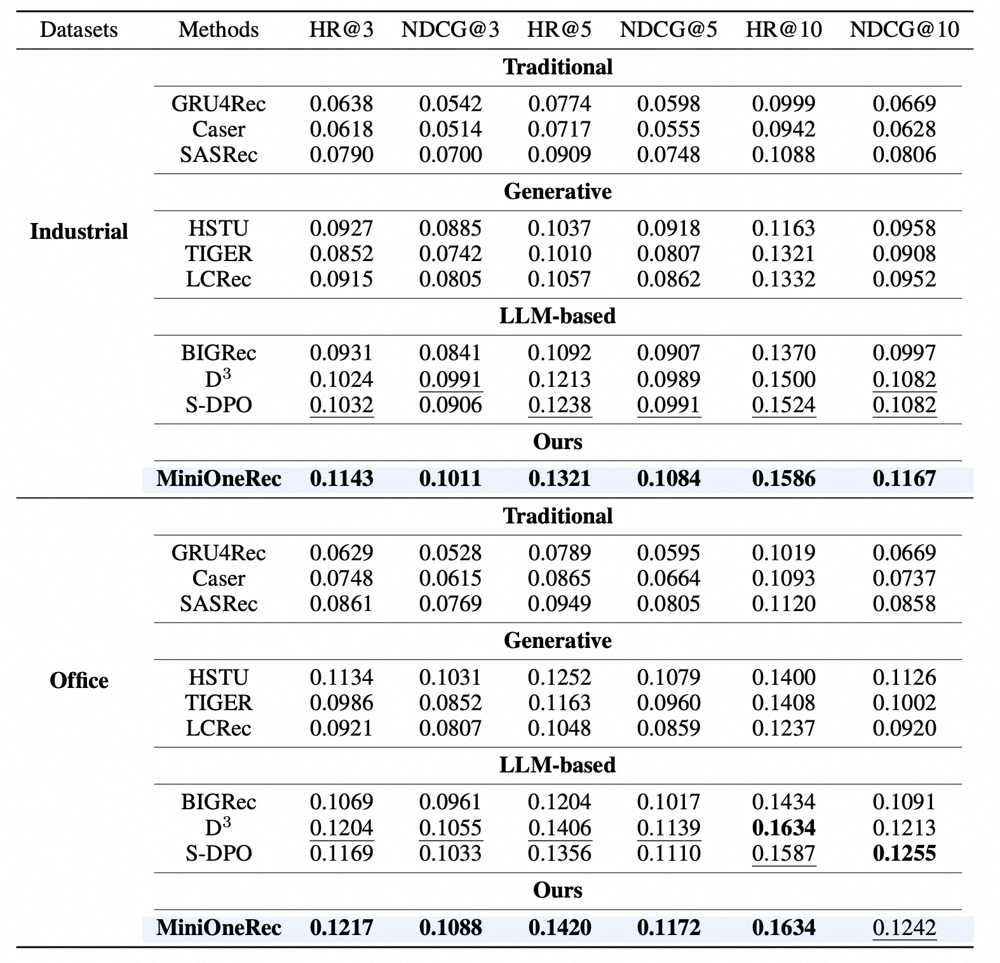

<div align="center">


# MiniOneRec

**An Open-Source Framework for Generative Recommendation**

[](#installation)
[](./LICENSE)
[](https://arxiv.org/abs/2510.24431)

[Technical Report](https://arxiv.org/abs/2510.24431) |
[Hugging Face](https://huggingface.co/kkknight/MiniOneRec) |
[ModelScope](https://modelscope.cn/models/k925238839/MiniOneRec)

</div>

MiniOneRec is a fully open-source framework for **generative recommendation**. It provides an end-to-end pipeline that covers:

- **semantic ID (SID) construction**
- **supervised fine-tuning (SFT)**
- **recommendation-oriented reinforcement learning (RL)**
- **offline constrained-decoding evaluation**

The project is designed around the following workflow:

```text
preprocess -> text embedding -> SID construction -> dataset conversion -> SFT -> RL -> evaluate
```

## Highlights

- End-to-end open-source training and evaluation code for generative recommendation
- Multiple SID construction backends, including RQ-VAE, RQ-Kmeans, constrained RQ-Kmeans, and RQ-Kmeans+
- SFT stage with SID prediction and SID-language alignment tasks
- RL stage based on GRPO-style group optimization for recommendation
- Constrained decoding during evaluation to keep generated items valid
- Ready-to-run example shell scripts for Industrial and Office-style Amazon datasets

## Framework

<div align="center">
  
</div>

## Main Results

<div align="center">
  
</div>

## Installation

### 1. Create a Python environment

```bash
conda create -n MiniOneRec python=3.11 -y
conda activate MiniOneRec
```

### 2. Install dependencies

```bash
pip install -r requirements.txt
```

### 3. Recommended hardware

For the full training pipeline, we recommend:

- Linux
- CUDA-enabled GPUs
- 4 or more high-memory GPUs for large-model SFT/RL runs

The provided shell scripts are written as **experiment launch templates**. Before running them, you should check:

- category names
- model paths
- GPU ids / process counts
- output directories

## Quick Start

If you already have prepared SID files and converted CSV files for Industrial or Office, the fastest way to reproduce the main pipeline is:

```bash
bash sft.sh
bash rl.sh
bash evaluate.sh
```

Important:

- The root `*.sh` scripts in this repository are **editable experiment scripts**, not fully parameterized CLIs.
- They contain hard-coded examples for categories, paths, and GPU counts.
- You should edit them to match your environment before running.

## End-to-End Pipeline

### 1. Data preprocessing

For Amazon 2018:

```bash
bash data/amazon18_data_process.sh \
  --dataset Industrial \
  --user_k 5 \
  --item_k 5 \
  --st_year 2017 \
  --st_month 10 \
  --ed_year 2018 \
  --ed_month 11 \
  --output_path ./data/Amazon18
```

For Amazon 2023:

```bash
bash data/amazon23_data_process.sh \
  --dataset All_Beauty \
  --metadata_file /path/to/meta.jsonl.gz \
  --reviews_file /path/to/reviews.jsonl.gz \
  --output_path ./data/Amazon23
```

### 2. Generate item text embeddings

```bash
bash rq/text2emb/amazon_text2emb.sh \
  --dataset Industrial_and_Scientific \
  --root ./data/Amazon18/Industrial_and_Scientific \
  --plm_name qwen \
  --plm_checkpoint /path/to/text-encoder
```

### 3. Train a SID model

MiniOneRec supports several SID construction methods.

RQ-VAE example:

```bash
bash rq/rqvae.sh
```

Constrained RQ-Kmeans example:

```bash
bash rq/rqkmeans_constrained.sh
```

RQ-Kmeans+ example:

```bash
bash rq/rqkmeans_plus.sh
```

### 4. Generate SID indices

RQ-VAE:

```bash
python rq/generate_indices.py
```

RQ-Kmeans+:

```bash
bash rq/generate_indices_plus.sh
```

### 5. Convert the dataset to the SFT/RL format

```bash
python convert_dataset.py \
  --dataset_name Industrial_and_Scientific \
  --data_dir /path/to/dataset_dir \
  --output_dir /path/to/output_dir
```

### 6. Supervised fine-tuning

The default example launcher is:

```bash
bash sft.sh
```

The actual training implementation lives in:

- `sft.py`
- `data.py`

### 7. Recommendation-oriented RL

```bash
bash rl.sh
```

The main RL implementation lives in:

- `rl.py`
- `minionerec_trainer.py`

### 8. Offline evaluation

```bash
bash evaluate.sh
```

The evaluation pipeline uses:

- constrained decoding
- parallel test-file splitting
- JSON merge
- HR/NDCG calculation

## Repository Structure

| Path | Description |
| --- | --- |
| `sft.py` | SFT training entrypoint |
| `rl.py` | RL training entrypoint |
| `evaluate.py` | Offline evaluation entrypoint |
| `data.py` | Dataset construction for SFT and RL |
| `convert_dataset.py` | Converts processed data into SFT/RL-ready CSV files |
| `minionerec_trainer.py` | GRPO-style trainer for recommendation-oriented RL |
| `LogitProcessor.py` | Constrained decoding logic |
| `split.py / merge.py / calc.py` | Parallel evaluation helpers |
| `data/` | Data preprocessing scripts and prepared artifacts |
| `rq/` | Text embedding, quantization, and SID generation |
| `config/` | Accelerate / DeepSpeed-related runtime config |
| `assets/` | README figures and logos |

## Training Notes

- `sft.sh`, `rl.sh`, and `evaluate.sh` are example launch scripts meant to be edited.
- Categories such as `Industrial_and_Scientific`, `Office_Products`, and `Toys_and_Games` are configured directly in those scripts.
- Multi-GPU behavior is controlled in the shell launchers through `torchrun` or `accelerate launch`.
- For RL, the current default examples use recommendation-oriented rewards and multi-generation GRPO-style training.

## Known Issues

- If constrained decoding does not work correctly during evaluation, the `CC` metric printed by `calc.py` may be non-zero.
- Some Instruct-style checkpoints may behave differently from base checkpoints under constrained decoding, depending on `transformers` and generation defaults.
- If you see many invalid generated items during evaluation, check:
  - model type (base vs instruct)
  - generation config defaults
  - constrained decoding behavior
  - dependency versions

## Contributing

Issues and pull requests are welcome.

When reporting a bug, please include:

- the dataset category
- the exact command or shell script you ran
- the model checkpoint you used
- the relevant traceback or evaluation warning
- your key library versions

## Acknowledgements

This repository reuses or adapts ideas or code from the following open-source projects:

- [ReRe](https://github.com/sober-clever/ReRe)
- [LC-Rec](https://github.com/zhengbw0324/LC-Rec)

## Citation

If you find this repository useful, please cite:

```bibtex
@misc{MiniOneRec,
  title={MiniOneRec: An Open-Source Framework for Scaling Generative Recommendation},
  author={Xiaoyu Kong and Leheng Sheng and Junfei Tan and Yuxin Chen and Jiancan Wu and An Zhang and Xiang Wang and Xiangnan He},
  year={2025},
  eprint={2510.24431},
  archivePrefix={arXiv},
  primaryClass={cs.IR}
}

@article{ReRe,
  title={Reinforced Preference Optimization for Recommendation},
  author={Junfei Tan and Yuxin Chen and An Zhang and Junguang Jiang and Bin Liu and Ziru Xu and Han Zhu and Jian Xu and Bo Zheng and Xiang Wang},
  journal={arXiv preprint arXiv:2510.12211},
  year={2025}
}

@inproceedings{RecZero,
  title={Think before Recommendation: Autonomous Reasoning-enhanced Recommender},
  author={Xiaoyu Kong and Junguang Jiang and Bin Liu and Ziru Xu and Han Zhu and Jian Xu and Bo Zheng and Jiancan Wu and Xiang Wang},
  booktitle={NeurIPS},
  year={2025}
}
```
